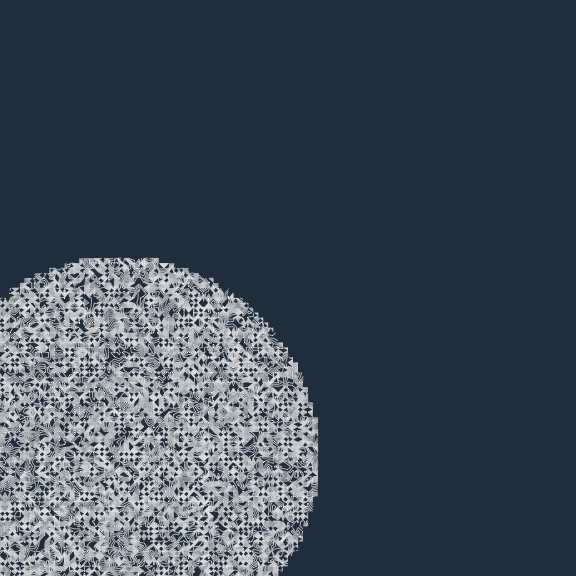
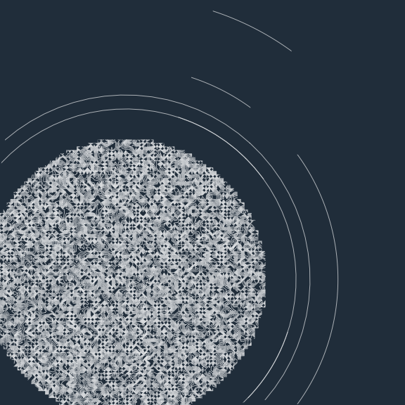

<!-- README.md is generated from README.Rmd. Please edit that file -->

# contouR

<!-- badges: start -->

<!-- badges: end -->

contouR is a package that is a wraparound for `ggplot2::geom_contour()`
to use for generative art. `geom_contour()` allows one to visualize 3D
surfaces in 2D by using x, y and z coordinates. To change it up from the
typical contour plot, there are three different distributions used to
generate the z values: `rnorm()`, `runif()`, and `rpois()`.

## Installation

You can install the current verion of contouR from
[GitHub](https://github.com/) with:

``` r
# install.packages("devtools")
devtools::install_github("Ijeamakaanyene/contouR")
```

If you make any fun art with this package, please feel free to contact
me on twitter <a href="https://twitter.com/ijeamaka_a"> @ijeamaka\_a</a>
to show it off 🌔

## Example: without rings

``` r
library(contouR)

#set up your data
setup = contour_grid(grid_size = 30, point_dist = .25, 
             z_method = "runif", z = 10, z_span = 3) %>%
  contour_shape(radius = 10.2, 
                x_center = 7, y_center = 7) 

# plot your data
contour_plot(setup$grid_shape) +
  ggplot2::xlim(1, 30) +
  ggplot2::ylim(1, 30)
```



## Example: with rings

``` r
#set up your data
setup = contour_grid(grid_size = 30, point_dist = .25, 
             z_method = "runif", z = 10, z_span = 3) %>%
  contour_shape(radius = 10.2, 
                x_center = 10, y_center = 10, 
                ring_system = "multiple",
                num_rings = 10)

# plot your data
contour_plot(setup$grid_shape, setup$rings) +
  ggplot2::xlim(1, 30) +
  ggplot2::ylim(1, 30)
#> Warning in if (is.na(rings) == FALSE) {: the condition has length > 1 and only
#> the first element will be used
#> Warning in if (is.na(rings) == TRUE) {: the condition has length > 1 and only
#> the first element will be used
#> Warning: Removed 407 row(s) containing missing values (geom_path).
```


